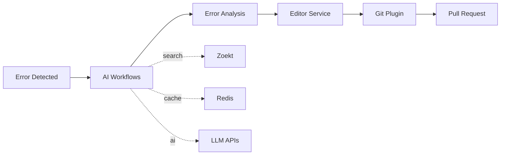

# HealCode Architecture Documentation

Tài liệu kiến trúc hệ thống HealCode - AI-powered Code Improvement System

## 📚 Danh Mục Tài Liệu

### 🎯 System Overview
- **[system-structure.md](system-structure.md)** - Cấu trúc tổng quan của hệ thống
- **[automatic-code-improvement-system-architecture.mermaid](automatic-code-improvement-system-architecture.mermaid)** - Kiến trúc hệ thống tự động cải thiện code

### 🔧 Component Architecture
- **[component-architecture.mermaid](component-architecture.mermaid)** - Kiến trúc các thành phần chính
- **[detailed-component-diagram.mermaid](detailed-component-diagram.mermaid)** - Sơ đồ chi tiết các components

### 🔄 Workflow & Processing
- **[request-processing-workflow.mermaid](request-processing-workflow.mermaid)** - Quy trình xử lý requests
- **[sequence-diagram---request-processing.mermaid](sequence-diagram---request-processing.mermaid)** - Sequence diagram của request processing

### 🧠 AI Workflows Module (NEW!)
- **[workflows-architecture.md](workflows-architecture.md)** - ⭐ **Tài liệu chi tiết về AI Workflows**
  - LangGraph workflow engine
  - 4-node error analysis pipeline
  - Multi-language support
  - Security & performance features
  - Configuration management
  - Integration guides
  
- **[workflows-system-diagram.mermaid](workflows-system-diagram.mermaid)** - 🎨 **Sơ đồ hệ thống workflows**
  - Visual workflow architecture
  - Component interactions
  - Data flow diagrams
  
- **[workflows-quick-reference.md](workflows-quick-reference.md)** - 🚀 **Quick reference guide**
  - Usage examples
  - Configuration cheat sheet
  - Common patterns
  - Troubleshooting tips

- **[USAGE-EXAMPLES-VI.md](USAGE-EXAMPLES-VI.md)** - 📖 **Hướng dẫn sử dụng chi tiết (Tiếng Việt)**
  - 5+ ví dụ thực tế với code đầy đủ
  - Sử dụng cơ bản đến nâng cao
  - Batch processing, auto-fix, custom config
  - Integration với Editor service
  - Step-by-step tutorials

- **[WORKFLOWS-IMPROVEMENTS.md](WORKFLOWS-IMPROVEMENTS.md)** - 🔧 **Phân tích cải thiện & roadmap**
  - Critical issues cần fix ngay
  - High/medium/low priority improvements
  - Code examples cho mỗi fix
  - 3-week action plan
  - Best practices recommendations

### 📝 Editor Module
- **[EDITOR-MODULE-VI.md](EDITOR-MODULE-VI.md)** - 📖 **Tài liệu Editor Module (Tiếng Việt)**
  - 4 editing strategies (Line, Pattern, AST, Range)
  - Concurrent access control & file locking
  - Automatic backups & rollback
  - API reference với examples
  - Integration với AI Workflows
  - Security & best practices

### 🔌 Git Plugin System
- **[git-plugin-system-architecture.md](git-plugin-system-architecture.md)** - Kiến trúc Git plugin chi tiết
  - Git operations
  - Provider integrations (GitHub, GitLab, Bitbucket)
  - Credential management
  - Pull request automation

### 🔍 Zoekt Integration
- **[zoekt-integration.mermaid](zoekt-integration.mermaid)** - Tích hợp Zoekt search engine

---

## 🏗️ Kiến Trúc Tổng Quan

```
HealCode System
│
├── 🧠 AI Module (ai/)
│   ├── Workflows ⭐ NEW DOCS!
│   │   ├── LangGraph error analysis
│   │   ├── Multi-language parsers
│   │   ├── Few-shot learning
│   │   └── Context-aware analysis
│   ├── Services
│   │   └── AI Service (Gemini, GPT-4, Claude)
│   └── Core
│       ├── Error context collector
│       ├── Function analyzer
│       └── Cache manager
│
├── 📝 Editor Module (editor/)
│   ├── Line editor
│   ├── Pattern editor
│   ├── AST editor
│   └── Backup/rollback system
│
├── 🔧 Git Plugin (gitplugin/)
│   ├── Git operations engine
│   ├── Credentials manager
│   ├── PR creator
│   └── Multi-provider support
│
├── 🔍 Indexer (indexer/)
│   └── Zoekt client
│
└── 🌐 Serve (serve/)
    ├── API service
    ├── Queue manager
    └── Task processor
```

---

## 🎯 AI Workflows - Key Highlights

**AI Workflows** là module mới nhất và quan trọng nhất của hệ thống, cung cấp:

### ✨ Core Features
- **4-Node LangGraph Workflow**: parse_error → parse_file → find_dependencies → analyze_impact
- **Multi-Language Support**: Python, Java, JavaScript, TypeScript, Rust
- **Context-Aware Analysis**: Full dependency tree, usage patterns, import detection
- **AI-Powered Fixes**: Google Gemini, OpenAI GPT-4, Anthropic Claude
- **Production-Ready**: Security sandboxing, caching, metrics, monitoring

### 📖 Documentation Structure

| Document | Purpose | Audience |
|----------|---------|----------|
| [workflows-architecture.md](workflows-architecture.md) | Comprehensive technical documentation | Developers, Architects |
| [workflows-system-diagram.mermaid](workflows-system-diagram.mermaid) | Visual system architecture | All stakeholders |
| [workflows-quick-reference.md](workflows-quick-reference.md) | Quick start & common patterns | Developers, Users |

### 🚀 Quick Start

```python
from ai.workflows import ErrorAnalysisWorkflow, WorkflowConfig
from indexer.zoekt_client import ZoektClient

# 1. Setup
config = WorkflowConfig()
workflow = ErrorAnalysisWorkflow(config)
zoekt = ZoektClient("http://localhost:6070")
workflow.setup(zoekt)

# 2. Analyze error
result = await workflow.run_analysis(
    "NameError: name 'user_id' is not defined at auth.py:42"
)

# 3. Get fix suggestions
print(result["impact_analysis"]["fix_suggestions"])
```

👉 **Chi tiết**: Xem [workflows-quick-reference.md](workflows-quick-reference.md)

---

## 🔄 Complete System Flow



---

## 📐 Module Relationships

```
┌─────────────────────────────────────────────────┐
│              API Layer (serve/)                 │
│  - Request handling                             │
│  - Queue management                             │
│  - Task orchestration                           │
└─────────────────┬───────────────────────────────┘
                  │
        ┌─────────┴─────────┐
        │                   │
┌───────▼───────┐   ┌──────▼──────────────────────┐
│  Git Plugin   │   │    AI Module ⭐              │
│  - Operations │   │  ┌─────────────────────┐    │
│  - Credentials│   │  │   Workflows         │    │
│  - PR Creator │   │  │  - Error Analysis   │    │
└───────┬───────┘   │  │  - Multi-language   │    │
        │           │  │  - Context-aware    │    │
        │           │  └─────────┬───────────┘    │
        │           │            │                 │
        │           │  ┌─────────▼───────────┐    │
        │           │  │   AI Service        │    │
        │           │  │  - LLM Integration  │    │
        │           │  └─────────────────────┘    │
        │           └────────┬────────────────────┘
        │                    │
        │           ┌────────▼────────┐
        └──────────►│ Editor Service  │
                    │  - Code editing │
                    │  - Backup/Roll  │
                    └────────┬────────┘
                             │
                    ┌────────▼────────┐
                    │    Indexer      │
                    │  - Zoekt client │
                    │  - Code search  │
                    └─────────────────┘
```

---

## 🎓 Recommended Reading Order

### For Developers
1. **Start**: [workflows-quick-reference.md](workflows-quick-reference.md) - Hiểu nhanh workflows
2. **Deep dive**: [workflows-architecture.md](workflows-architecture.md) - Chi tiết kỹ thuật
3. **Visualize**: [workflows-system-diagram.mermaid](workflows-system-diagram.mermaid) - Sơ đồ hệ thống
4. **Integrate**: [git-plugin-system-architecture.md](git-plugin-system-architecture.md) - Git integration

### For Architects
1. **System overview**: [system-structure.md](system-structure.md)
2. **Components**: [component-architecture.mermaid](component-architecture.mermaid)
3. **Workflows**: [workflows-architecture.md](workflows-architecture.md)
4. **Processing flow**: [request-processing-workflow.mermaid](request-processing-workflow.mermaid)

### For New Contributors
1. **Quick start**: [workflows-quick-reference.md](workflows-quick-reference.md)
2. **Example code**: `ai/workflows/example_usage.py`
3. **Configuration**: `ai/configs/development.yaml`
4. **Main docs**: [workflows-architecture.md](workflows-architecture.md)

---

## 🔗 Related Resources

### Code Locations
- **Workflows**: `ai/workflows/`
- **AI Service**: `ai/services/ai_service.py`
- **Editor**: `editor/service.py`
- **Git Plugin**: `gitplugin/`
- **Examples**: `ai/workflows/example_usage.py`

### Configuration Files
- **Development**: `ai/configs/development.yaml`
- **Production**: `ai/configs/production.yaml`
- **Environment**: `ai/configs/environment.template`

### External Documentation
- **LangGraph**: https://langchain-ai.github.io/langgraph/
- **Tree-sitter**: https://tree-sitter.github.io/tree-sitter/
- **Zoekt**: https://github.com/google/zoekt
- **Redis**: https://redis.io/docs/

---

## 📝 Document Status

| Document | Status | Last Updated | Version |
|----------|--------|--------------|---------|
| workflows-architecture.md | ✅ Complete | 2024-11 | 1.0 |
| workflows-system-diagram.mermaid | ✅ Complete | 2024-11 | 1.0 |
| workflows-quick-reference.md | ✅ Complete | 2024-11 | 1.0 |
| git-plugin-system-architecture.md | ✅ Complete | 2024-10 | 1.0 |
| system-structure.md | ⚠️  Basic | 2024-09 | 0.5 |
| component-architecture.mermaid | ✅ Complete | 2024-10 | 1.0 |

---

## 🤝 Contributing to Documentation

Khi thêm hoặc cập nhật tài liệu:

1. **File naming**: Use kebab-case (`my-document.md`)
2. **Mermaid diagrams**: Use `.mermaid` extension
3. **Update this README**: Add entry in appropriate section
4. **Version control**: Update document status table
5. **Links**: Use relative links for internal docs

### Documentation Standards
- ✅ Include code examples
- ✅ Add diagrams when helpful
- ✅ Explain "why" not just "what"
- ✅ Keep examples up-to-date
- ✅ Use consistent formatting

---

## 📧 Questions?

For questions about:
- **AI Workflows**: See [workflows-architecture.md](workflows-architecture.md) or [workflows-quick-reference.md](workflows-quick-reference.md)
- **Git Plugin**: See [git-plugin-system-architecture.md](git-plugin-system-architecture.md)
- **System Overview**: See [system-structure.md](system-structure.md)
- **General Architecture**: Start with this README

---

**Last Updated**: November 2024  
**Version**: 2.0 (Added AI Workflows documentation)

