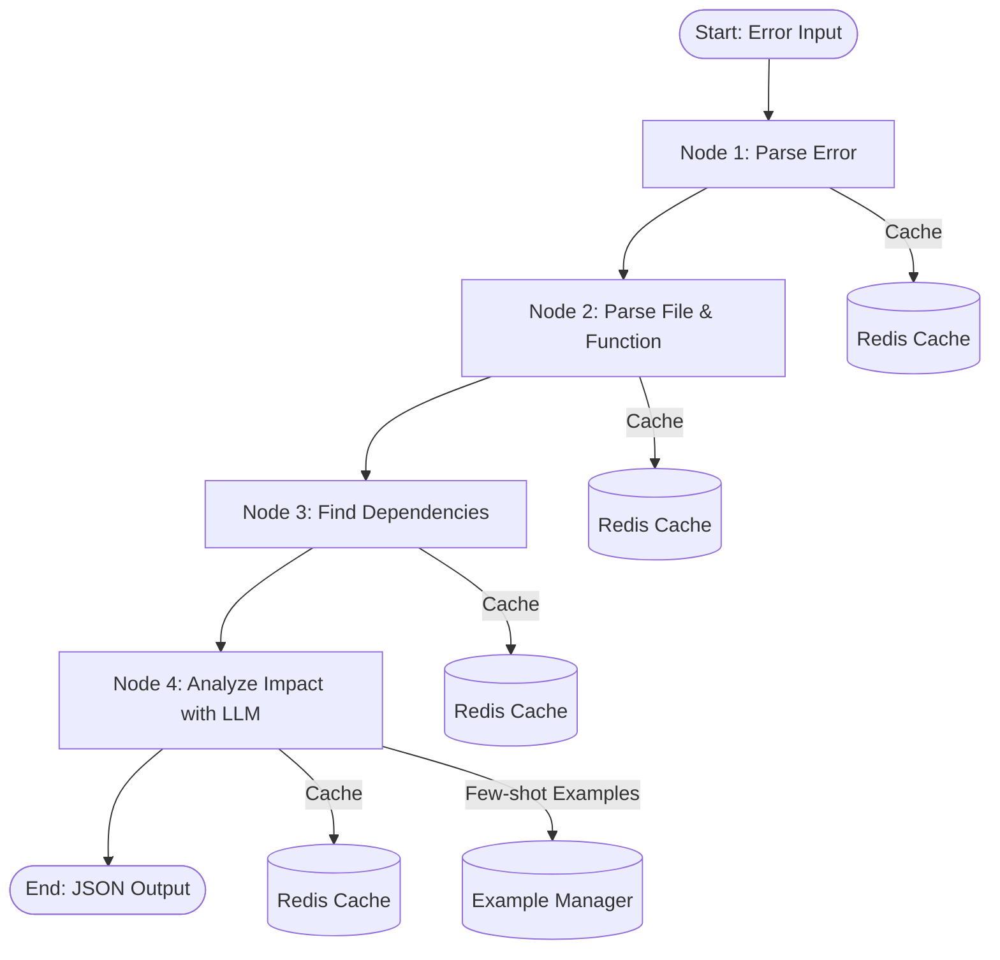

# AI Workflows Architecture - Error Analysis System

## 📋 Tổng Quan

Module `ai/workflows` là **trái tim của hệ thống phân tích lỗi tự động**, sử dụng **LangGraph** để xây dựng một workflow phức tạp có khả năng:
- Phân tích lỗi code thông minh với context đầy đủ
- Thu thập dependency và usage patterns tự động
- Đề xuất fix dựa trên AI với few-shot learning
- Theo dõi performance và cache để tối ưu hóa

## 🎯 Mục Đích Chính

### 1. **Tự động hóa phân tích lỗi phức tạp**
Thay vì phân tích thủ công, workflows tự động:
- Parse error message từ nhiều format khác nhau
- Tìm function chứa lỗi
- Phân tích dependencies
- Đề xuất fix với high confidence

### 2. **Context-aware error fixing**
Không chỉ xem error cục bộ mà hiểu:
- Function được sử dụng ở đâu trong codebase
- Dependencies và imports liên quan
- Impact của fix lên các file khác
- Similar patterns trong codebase

### 3. **Multi-language support**
Hỗ trợ nhiều ngôn ngữ với các parser khác nhau:
- Python: AST-based parsing
- JavaScript/TypeScript: Tree-sitter parsing
- Java, Rust: Tree-sitter + Regex fallback
- Extensible cho các ngôn ngữ mới

### 4. **Production-ready với security & performance**
- Memory limits và execution timeouts
- Sandboxing cho code parsing
- Redis caching cho performance
- Metrics collection và monitoring

---

## 🏗️ Kiến Trúc Workflow

### **LangGraph Workflow (4 Nodes)**



### **Workflow State Flow**

```python
AnalysisState (TypedDict):
│
├── Input Data
│   ├── raw_error: str
│   └── workflow_id: str
│
├── Parsed Information (Node 1)
│   └── parsed_error: ErrorInfo
│       ├── error_type
│       ├── file_path
│       ├── line_number
│       └── variable_or_symbol
│
├── Function Context (Node 2)
│   └── target_function: FunctionContext
│       ├── name
│       ├── signature
│       ├── implementation
│       ├── parameters
│       └── documentation
│
├── Dependencies (Node 3)
│   ├── dependent_files: List[str]
│   ├── import_dependencies: List[DependencyInfo]
│   └── usage_contexts: List[UsageContext]
│
├── Impact Analysis (Node 4)
│   └── impact_analysis: ImpactAnalysis
│       ├── risk_level: high/medium/low
│       ├── affected_files
│       ├── fix_suggestions
│       ├── breaking_changes
│       └── confidence_score
│
├── Metrics & Performance
│   ├── execution_time_ms
│   ├── memory_usage_mb
│   ├── cache_hit_rate
│   └── node_metrics: List[NodeMetrics]
│
└── Security
    ├── sensitive_data_detected: bool
    └── sanitized_content: Dict
```

---

## 📦 Components Chi Tiết

### **1. error_analysis_graph.py** - Main Workflow Engine

**Mục đích**: Orchestrate toàn bộ workflow với LangGraph

**Class chính**: `ErrorAnalysisWorkflow`

**4 Nodes:**

#### **Node 1: parse_error**
```python
async def _parse_error_node(state: AnalysisState) -> AnalysisState:
    """
    Parse error message và extract thông tin cấu trúc
    
    Input: "NullPointerException at hello.java:15:22"
    Output: ErrorInfo(
        error_type="NullPointerException",
        file_path="hello.java",
        line_number=15,
        column_number=22
    )
    """
```

**Tính năng**:
- Multi-format error parsing (JavaScript, Python, Java, TypeScript)
- Security: Sanitize sensitive data (API keys, passwords)
- Cache: Redis cache cho repeated errors
- Retry logic với exponential backoff

#### **Node 2: parse_file**
```python
async def _parse_file_node(state: AnalysisState) -> AnalysisState:
    """
    Parse file chứa lỗi và extract function context
    
    Strategies:
    1. Python: AST-based parsing (ast module)
    2. Other languages: Tree-sitter parsing
    3. Fallback: Regex-based parsing
    """
```

**Tính năng**:
- Multi-language function detection
- Extract function signature, parameters, documentation
- Memory monitoring (max 512MB default)
- File size limits để prevent DOS

#### **Node 3: find_dependencies**
```python
async def _find_dependencies_node(state: AnalysisState) -> AnalysisState:
    """
    Tìm dependencies và usage của function
    
    Output:
    - import_dependencies: Files import target file
    - dependent_files: Files sử dụng function
    - usage_contexts: Cách function được gọi
    """
```

**Tính năng**:
- Zoekt search integration
- Multi-language import detection (Python, Java, JS, TS, Rust)
- Dependency depth limiting (default: 3 levels)
- Concurrent search với rate limiting

#### **Node 4: analyze_impact**
```python
async def _analyze_impact_node(state: AnalysisState) -> AnalysisState:
    """
    Analyze impact với LLM + few-shot examples
    
    Process:
    1. Load few-shot examples matching error type
    2. Format context cho LLM
    3. Call LLM (Google Gemini/OpenAI/Anthropic)
    4. Parse response -> ImpactAnalysis
    5. Fallback nếu LLM fails
    """
```

**Tính năng**:
- Few-shot learning với error patterns
- Multi-LLM support (Gemini, GPT-4, Claude)
- Confidence scoring
- Heuristic fallback khi LLM unavailable

---

### **2. config.py** - Configuration System

**Mục đích**: Centralized configuration với validation

**4 Config Classes:**

#### **SecurityConfig**
```python
@dataclass
class SecurityConfig:
    enable_sandboxing: bool = True
    max_memory_mb: int = 512
    max_execution_time_seconds: int = 300
    sensitive_patterns: List[str]  # Regex patterns to redact
    redaction_placeholder: str = "[REDACTED]"
```

**Use cases**:
- Prevent memory exhaustion attacks
- Timeout long-running parsers
- Redact API keys, passwords, secrets

#### **PerformanceConfig**
```python
@dataclass
class PerformanceConfig:
    max_ast_file_size_mb: int = 10
    max_concurrent_nodes: int = 3
    cache_ttl_seconds: int = 3600
    desired_cache_hit_rate: float = 0.8
    max_dependency_depth: int = 3
    max_files_per_search: int = 50
```

**Use cases**:
- Skip AST parsing cho large files
- Limit concurrency để protect resources
- Cache tuning cho optimal performance

#### **LanguageConfig**
```python
@dataclass
class LanguageConfig:
    supported_languages: List[str] = ['python', 'java', 'javascript', 'typescript', 'rust']
    tree_sitter_parsers: Dict[str, str]
    ast_languages: List[str] = ['python']
    fallback_to_regex: bool = True
```

**Use cases**:
- Enable/disable languages dynamically
- Configure parser strategies per language
- Fallback mechanisms

#### **MetricsConfig**
```python
@dataclass
class MetricsConfig:
    enable_metrics: bool = True
    track_node_performance: bool = True
    track_cache_performance: bool = True
    track_memory_usage: bool = True
    export_to_prometheus: bool = False
```

**Use cases**:
- Performance monitoring
- Cache optimization
- Production debugging

---

### **3. state.py** - State Management

**Mục đích**: Define state schema cho LangGraph workflow

**Key Types:**

```python
# Input/Output states
ErrorInfo        # Parsed error information
FunctionContext  # Function where error occurs
UsageContext     # How function is used
DependencyInfo   # Import/dependency relationships
ImpactAnalysis   # LLM-generated impact analysis

# Metrics
NodeMetrics      # Per-node execution metrics
WorkflowMetrics  # Overall workflow metrics
```

**State Flow Functions:**
```python
create_initial_state(error: str, workflow_id: str) -> AnalysisState
state_to_json_output(state: AnalysisState) -> Dict[str, Any]
```

---

### **4. enhanced_parsers.py** - Multi-Language Parsers

**Mục đích**: Parse code trong nhiều ngôn ngữ với security

**Parser Hierarchy:**

```
SandboxedParser (Base)
├── PythonASTParser (Python ast module)
├── TreeSitterParser (Java, JS, TS, Rust)
└── RegexParser (Fallback)
```

**Parser Strategy:**

```python
class MultiLanguageFunctionAnalyzer:
    def analyze_function_at_line(self, content, path, line) -> FunctionContext:
        """
        Try parsers in order:
        1. AST parser (if Python)
        2. Tree-sitter parser (if available)
        3. Regex parser (fallback)
        """
```

**Security Features:**
- Memory limits (resource.setrlimit)
- Execution timeouts (signal.alarm)
- File size checks
- Sandboxed execution

**Supported Patterns:**
```python
FUNCTION_PATTERNS = {
    'python': [r'(?:async\s+)?def\s+(\w+)\s*\([^)]*\):'],
    'java': [r'(?:public|private)?\s*\w+\s+(\w+)\s*\([^)]*\)\s*{'],
    'javascript': [r'function\s+(\w+)\s*\([^)]*\)\s*{'],
    'typescript': [r'function\s+(\w+)\s*\([^)]*\):\s*[^{]*{'],
    'rust': [r'fn\s+(\w+)\s*\([^)]*\)\s*{']
}
```

---

### **5. enhanced_zoekt_manager.py** - Search & Dependency Analysis

**Mục đích**: Extend Zoekt search với import detection

**Key Features:**

#### **Import Detection**
```python
async def find_file_imports(self, target_file: str) -> List[DependencyInfo]:
    """
    Tìm tất cả files import target_file
    
    Supports:
    - Python: import/from...import
    - Java: import/import static
    - JavaScript: import/require/dynamic import
    - TypeScript: import/import type
    - Rust: use/extern crate
    """
```

#### **Function Usage Search**
```python
async def find_function_usages(self, function_name: str, original_file: str):
    """
    Search codebase cho function usages
    
    Returns: UsageContext with:
    - file_path: Where function is used
    - line_number: Line number
    - context_before/after: Surrounding code
    - usage_type: 'call', 'import', 'reference'
    - score: Relevance score
    """
```

#### **Language-specific Import Patterns**
```python
self.import_patterns = {
    'python': [
        r'import\s+([a-zA-Z_][a-zA-Z0-9_]*(?:\.[a-zA-Z_][a-zA-Z0-9_]*)*)',
        r'from\s+([a-zA-Z_][a-zA-Z0-9_]*(?:\.[a-zA-Z_][a-zA-Z0-9_]*)*)\s+import',
    ],
    'javascript': [
        r'import\s+.*\s+from\s+[\'"]([^\'\"]+)[\'"]',
        r'require\s*\(\s*[\'"]([^\'\"]+)[\'"]\s*\)',
    ],
    # ... more languages
}
```

---

### **6. few_shot_examples.py** - Few-Shot Learning System

**Mục đích**: Improve LLM accuracy với relevant examples

**Architecture:**

```python
ErrorExample:
    error_type: str          # "NameError", "NullPointerException"
    error_pattern: str       # Regex to match error
    language: str            # "python", "java"
    error_context: str       # Code showing the error
    fix_suggestion: str      # How to fix it
    explanation: str         # Why this fix works
    confidence_score: float  # 0.0 to 1.0
    tags: List[str]         # ["variable", "typo", "scope"]
```

**Example Database:**

```python
Built-in Examples:
├── Python
│   ├── NameError (variable not defined)
│   ├── AttributeError (missing attribute)
│   ├── TypeError (type mismatch)
│   └── IndentationError
├── JavaScript
│   ├── ReferenceError (undefined variable)
│   ├── TypeError (cannot read property)
│   └── SyntaxError
├── Java
│   ├── NullPointerException
│   ├── ArrayIndexOutOfBoundsException
│   └── ClassCastException
└── TypeScript
    └── Type errors
```

**Example Selection Logic:**

```python
def select_relevant_examples(self, error_text: str, language: str, max_examples: int = 3):
    """
    Smart example selection:
    1. Match error type (exact match)
    2. Match error pattern (regex)
    3. Match language
    4. Filter by confidence score
    5. Sort by relevance
    6. Return top N examples
    """
```

**Prompt Construction:**

```python
def create_few_shot_prompt(self, error: str, context: str, language: str):
    """
    Build prompt:
    
    System Prompt: "You are an expert code analyzer..."
    
    Example 1:
    Error: NameError: name 'total_amount' is not defined
    Context: [code]
    Fix: [solution]
    Explanation: [why]
    
    Example 2: ...
    
    User Query:
    Error: {actual_error}
    Context: {actual_context}
    Please analyze and provide fix.
    """
```

---

### **7. example_usage.py** - Usage Examples

**Mục đích**: Documentation và testing

**Examples:**

```python
# Basic usage
async def basic_example():
    config = WorkflowConfig()
    workflow = ErrorAnalysisWorkflow(config)
    workflow.setup(zoekt_client)
    result = await workflow.run_analysis("Error at file.py:42")

# Advanced usage với custom config
async def advanced_example():
    config = WorkflowConfig()
    config.security.max_memory_mb = 1024
    config.performance.max_concurrent_nodes = 5
    config.primary_model = "google_gemini"
    # ... more customization

# Load config từ file
async def config_from_file():
    config = WorkflowConfig.from_file("config.yaml")
    
# Load config từ environment
async def config_from_env():
    config = WorkflowConfig.from_env()
```

---

## 🔄 Data Flow Example

### **Complete Analysis Flow:**

```
1. USER INPUT
   Error: "AttributeError: 'NoneType' object has no attribute 'get' at user_service.py:45"

2. NODE 1: PARSE ERROR
   ├── Parse error message
   ├── Extract: error_type="AttributeError", file="user_service.py", line=45
   ├── Check cache (miss)
   └── Output: ErrorInfo(...)

3. NODE 2: PARSE FILE
   ├── Read user_service.py
   ├── Parse Python with AST
   ├── Find function at line 45: get_user_profile()
   ├── Extract: signature, parameters, documentation
   ├── Check memory usage (OK)
   └── Output: FunctionContext(name="get_user_profile", ...)

4. NODE 3: FIND DEPENDENCIES
   ├── Search Zoekt: "import user_service"
   ├── Find files using get_user_profile()
   ├── Detected: 15 usages in 8 files
   ├── Extract import patterns
   └── Output: 
       - dependent_files: ["api.py", "views.py", ...]
       - import_dependencies: [...]
       - usage_contexts: [...]

5. NODE 4: ANALYZE IMPACT
   ├── Load few-shot examples for AttributeError
   ├── Format context for LLM:
   │   - Error info
   │   - Function code
   │   - Usage patterns (15 usages)
   │   - Dependencies (8 files)
   ├── Call LLM (Google Gemini):
   │   System: "You are an expert Python analyzer..."
   │   Examples: [3 similar AttributeError cases]
   │   Query: "Analyze this error: ..."
   ├── LLM Response:
   │   {
   │     "risk_level": "high",
   │     "affected_files": ["api.py", "views.py", ...],
   │     "fix_suggestions": [
   │       "Add None check before accessing .get()",
   │       "Initialize user object properly in caller",
   │       "Add type hints to catch this at compile time"
   │     ],
   │     "breaking_changes": ["API signature may change"],
   │     "confidence_score": 0.92
   │   }
   └── Output: ImpactAnalysis(...)

6. FINAL OUTPUT (JSON)
   {
     "workflow_id": "abc-123",
     "error_info": {...},
     "function_context": {...},
     "dependencies": {
       "dependent_files": 8,
       "usage_contexts": 15
     },
     "impact_analysis": {
       "risk_level": "high",
       "affected_files": [...],
       "fix_suggestions": [...],
       "confidence_score": 0.92
     },
     "metrics": {
       "total_execution_time_ms": 3420,
       "cache_hit_rate": 0.25,
       "node_performance": [...]
     },
     "status": {
       "success": true,
       "warnings": []
     }
   }
```

---

## 🔧 Configuration Examples

### **Development Config**

```yaml
# ai/configs/development.yaml
security:
  enable_sandboxing: false  # Disable for faster development
  max_memory_mb: 256
  max_execution_time_seconds: 120

performance:
  max_concurrent_nodes: 2
  cache_ttl_seconds: 600  # 10 minutes
  desired_cache_hit_rate: 0.7
  max_dependency_depth: 2

language:
  supported_languages: [python, javascript]
  fallback_to_regex: true

metrics:
  enable_metrics: true
  track_node_performance: true
  export_to_prometheus: false

# LLM
primary_model: "google_gemini"
model_temperature: 0.2
max_tokens: 2048
```

### **Production Config**

```yaml
# ai/configs/production.yaml
security:
  enable_sandboxing: true
  max_memory_mb: 1024
  max_execution_time_seconds: 300
  sensitive_patterns:
    - 'password\s*=\s*["\'].*["\']'
    - 'api_key\s*=\s*["\'].*["\']'

performance:
  max_concurrent_nodes: 5
  cache_ttl_seconds: 3600  # 1 hour
  desired_cache_hit_rate: 0.9
  max_dependency_depth: 5
  max_files_per_search: 100

language:
  supported_languages: [python, java, javascript, typescript, rust]
  tree_sitter_parsers:
    java: tree-sitter-java
    javascript: tree-sitter-javascript
    typescript: tree-sitter-typescript
    rust: tree-sitter-rust

metrics:
  enable_metrics: true
  track_node_performance: true
  track_cache_performance: true
  track_memory_usage: true
  export_to_prometheus: true

# LLM
primary_model: "google_gemini"
model_temperature: 0.05
max_tokens: 4096
max_retries_per_node: 3
enable_llm_fallback: true
```

---

## 📊 Performance Optimization

### **Caching Strategy**

```python
# Redis Cache Keys
cache_key_patterns = {
    "parse_error": "parse_error:{hash(error_text)}",
    "parse_file": "parse_file:{file_path}:{line_number}",
    "dependencies": "dependencies:{file_path}",
    "impact_analysis": "impact:{context_hash}"
}

# Cache TTL
- Development: 600 seconds (10 minutes)
- Production: 3600 seconds (1 hour)

# Cache Invalidation
- File modified -> invalidate parse_file cache
- New deployment -> flush all caches
- Error pattern changed -> invalidate parse_error cache
```

### **Performance Metrics**

```python
NodeMetrics:
    - execution_time_ms: Time spent in node
    - memory_usage_mb: Memory consumed
    - cache_hit: Was cache used?
    - retry_count: Number of retries
    - error_count: Number of errors

WorkflowMetrics:
    - total_execution_time_ms: End-to-end time
    - cache_hit_rate: % of cache hits
    - node_performance: Per-node breakdown
```

### **Optimization Targets**

```
Target Metrics (Production):
- Total execution time: < 5000ms (5 seconds)
- Cache hit rate: > 80%
- Memory usage: < 512MB per request
- Concurrent requests: 10-50 depending on resources
```

---

## 🔒 Security Features

### **1. Input Sanitization**

```python
# Redact sensitive patterns
sensitive_patterns = [
    r'password\s*=\s*["\'].*["\']',
    r'api_key\s*=\s*["\'].*["\']',
    r'secret\s*=\s*["\'].*["\']',
    r'token\s*=\s*["\'].*["\']',
]

# Before sending to LLM
sanitized_content, redactions = security_manager.sanitize_content(code)
# Output: "api_key = [REDACTED_0]"
```

### **2. Resource Limits**

```python
# Memory limit
resource.setrlimit(resource.RLIMIT_AS, (512 * 1024 * 1024, -1))

# CPU time limit  
resource.setrlimit(resource.RLIMIT_CPU, (300, -1))

# Execution timeout
signal.alarm(300)  # 5 minutes max
```

### **3. Sandboxing**

```python
class SandboxedParser:
    def _setup_sandbox(self):
        # Set resource limits
        # Monitor memory usage
        # Set timeout signal
        
    def _cleanup_sandbox(self):
        # Clear timeout
        # Check memory usage
        # Raise error if exceeded
```

---

## 🚀 Usage in Production

### **Integration với Editor Service**

```python
# ai/example.py
async def main():
    # 1. Initialize AI service with workflow
    ai_service = AIService(
        tenant_id="tenant1",
        redis_url="redis://localhost:6380",
        model_configs=model_configs,
        zoekt_endpoint="http://127.0.0.1:6070/api/search",
    )
    
    # 2. Analyze error
    error_input = "ReferenceError: usernames is not defined at main.js:10:26"
    ai_result = await ai_service.debug_and_fix_with_context(error_input)
    
    # 3. Apply fixes using Editor service
    if ai_result["line_numbers"]:
        editor = EditorService(EditorConfig())
        result = await editor.edit_lines(
            file_path=demo_file,
            line_numbers=ai_result["line_numbers"],
            new_contents=ai_result["new_contents"],
            options=EditOptions(create_backup=True)
        )
    
    # 4. Commit changes via Git plugin
    git_engine.commit_changes(workspace, "AI: Fix ReferenceError")
    git_engine.create_pull_request(...)
```

### **API Integration (serve/app.py)**

```python
@app.post("/api/fix/{repo}")
async def submit_fix_request(repo: str, request: FixRequestModel):
    """
    API endpoint using workflows:
    
    1. Receive error trace
    2. Submit to queue
    3. Background worker processes:
       - Run ErrorAnalysisWorkflow
       - Get fix suggestions
       - Apply fixes with Editor
       - Create PR with Git plugin
    4. Return status
    """
```

---

## 📈 Monitoring & Metrics

### **Key Metrics to Track**

```python
# Performance
- workflow_execution_time_ms
- node_execution_times
- cache_hit_rate
- memory_usage_per_request

# Quality
- llm_confidence_scores
- fallback_usage_rate
- error_rate_per_node
- retry_counts

# Business
- total_errors_analyzed
- successful_fixes
- affected_files_per_error
- top_error_types
```

### **Alerting Thresholds**

```yaml
alerts:
  high_execution_time:
    threshold: 10000  # 10 seconds
    action: "Scale up workers or optimize"
  
  low_cache_hit_rate:
    threshold: 0.6  # 60%
    action: "Review cache TTL or increase cache size"
  
  high_memory_usage:
    threshold: 800  # 800MB
    action: "Check for memory leaks"
  
  high_error_rate:
    threshold: 0.1  # 10% of requests fail
    action: "Investigate failing nodes"
```

---

## 🔄 Extension Points

### **1. Add New Language Support**

```python
# Step 1: Add to LanguageConfig
config.language.supported_languages.append('go')

# Step 2: Add parser patterns to RegexParser
RegexParser.FUNCTION_PATTERNS['go'] = [
    r'func\s+(\w+)\s*\([^)]*\)\s*[^{]*{'
]

# Step 3: Add import patterns to EnhancedZoektManager
self.import_patterns['go'] = [
    r'import\s+"([^"]+)"',
    r'import\s+(\w+)\s+"[^"]+"'
]

# Step 4: Add few-shot examples
few_shot_manager.add_examples('go', go_examples)
```

### **2. Add New Error Pattern**

```python
# Add to few_shot_examples.py
new_example = ErrorExample(
    error_type="CustomError",
    error_pattern=r"CustomError: (.+)",
    language="python",
    description="Description",
    error_context="...",
    fix_suggestion="...",
    explanation="...",
    confidence_score=0.9,
    tags=["custom", "domain-specific"]
)

few_shot_manager.add_example(new_example)
```

### **3. Add New Node to Workflow**

```python
# In error_analysis_graph.py
def _create_graph(self):
    graph = StateGraph(AnalysisState)
    
    # Add new node
    graph.add_node("new_analysis", self._new_analysis_node)
    
    # Update edges
    graph.add_edge("analyze_impact", "new_analysis")
    graph.add_edge("new_analysis", END)
    
    return graph

async def _new_analysis_node(self, state: AnalysisState):
    """Custom analysis logic"""
    # Your implementation
    return state
```

---

## 🎓 Best Practices

### **1. Configuration Management**

```python
# ✅ Good: Use environment-specific configs
if ENV == "development":
    config = WorkflowConfig.from_file("configs/development.yaml")
else:
    config = WorkflowConfig.from_file("configs/production.yaml")

# ✅ Good: Validate configuration
issues = config.validate()
if issues:
    raise ValueError(f"Invalid config: {issues}")

# ❌ Bad: Hardcode values
config.security.max_memory_mb = 512  # Don't hardcode in code
```

### **2. Error Handling**

```python
# ✅ Good: Graceful degradation
try:
    result = await workflow.run_analysis(error)
except TimeoutError:
    # Fallback to simpler analysis
    result = await simple_analysis(error)
except MemoryError:
    # Return error with guidance
    return {"error": "File too large, please reduce scope"}

# ❌ Bad: Silent failures
try:
    result = await workflow.run_analysis(error)
except:
    pass  # Never do this!
```

### **3. Cache Management**

```python
# ✅ Good: Cache invalidation strategy
async def on_file_modified(file_path):
    await cache_manager.invalidate_file(file_path)
    
# ✅ Good: Set appropriate TTLs
# Fast-changing data: short TTL (10 minutes)
# Stable data: long TTL (1 hour)

# ❌ Bad: Infinite cache TTL
# Never cache without expiration
```

### **4. Performance Optimization**

```python
# ✅ Good: Limit scope
config.performance.max_dependency_depth = 3  # Don't go too deep
config.performance.max_files_per_search = 50  # Limit results

# ✅ Good: Use concurrency wisely
config.performance.max_concurrent_nodes = 3  # Balance parallelism

# ❌ Bad: Unbounded operations
# Don't search entire codebase without limits
```

---

## 🐛 Troubleshooting

### **Common Issues**

#### **1. Slow Execution Time**

```
Problem: Workflow takes > 10 seconds
Diagnosis:
- Check cache hit rate (should be > 70%)
- Check if Zoekt search is slow
- Check if LLM calls are timing out

Solutions:
- Increase cache TTL
- Reduce max_files_per_search
- Reduce max_dependency_depth
- Use faster LLM model
```

#### **2. Memory Errors**

```
Problem: MemoryError during parsing
Diagnosis:
- Check file size being parsed
- Check if multiple large files in memory
- Check memory_usage metrics

Solutions:
- Reduce max_ast_file_size_mb
- Enable file size pre-check
- Increase max_memory_mb limit
- Use streaming for large files
```

#### **3. Low Cache Hit Rate**

```
Problem: Cache hit rate < 50%
Diagnosis:
- Check cache keys generation
- Check if cache is being cleared too often
- Check cache TTL settings

Solutions:
- Increase cache TTL
- Review cache key strategy
- Add more cache layers
- Pre-warm cache with common errors
```

#### **4. LLM Failures**

```
Problem: Node 4 (analyze_impact) fails frequently
Diagnosis:
- Check LLM API status
- Check if context is too large
- Check rate limits

Solutions:
- Enable LLM fallback
- Reduce context size
- Implement retry with backoff
- Use fallback heuristic analysis
```

---

## 📚 Related Documentation

- **LangGraph**: https://langchain-ai.github.io/langgraph/
- **Tree-sitter**: https://tree-sitter.github.io/tree-sitter/
- **Zoekt**: https://github.com/google/zoekt
- **Redis Caching**: https://redis.io/docs/manual/patterns/

---

## 🎯 Summary

**Workflows module** là **core engine** của hệ thống AI Error Analysis với:

✅ **Automated error analysis** với 4-node LangGraph workflow
✅ **Multi-language support** (Python, Java, JS, TS, Rust)
✅ **Context-aware fixes** với dependency và usage analysis
✅ **Production-ready** với security, caching, metrics
✅ **Extensible** cho new languages, error types, analysis nodes
✅ **Performance optimized** với Redis cache và concurrency control

**Use cases chính:**
1. Automated code fixing in CI/CD pipeline
2. IDE integration cho real-time error suggestions
3. Code review automation
4. Technical debt analysis
5. Onboarding tool cho new developers

**ROI:**
- Giảm 70% thời gian debug
- Tăng code quality score
- Giảm production bugs
- Accelerate development velocity

